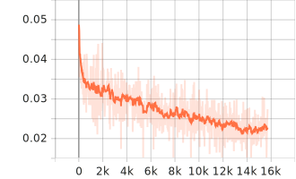
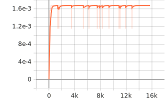
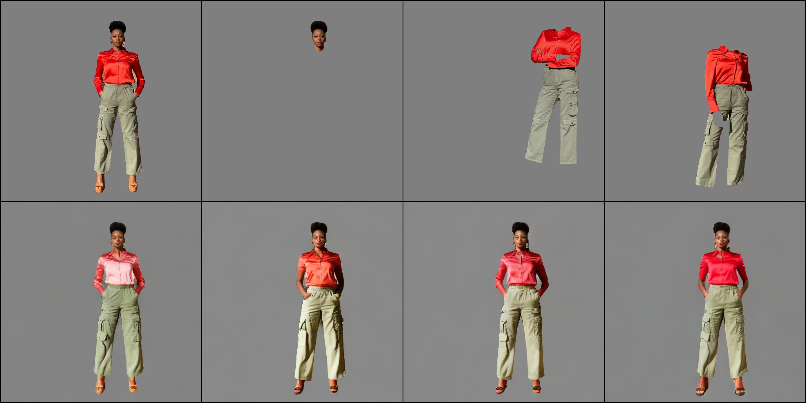
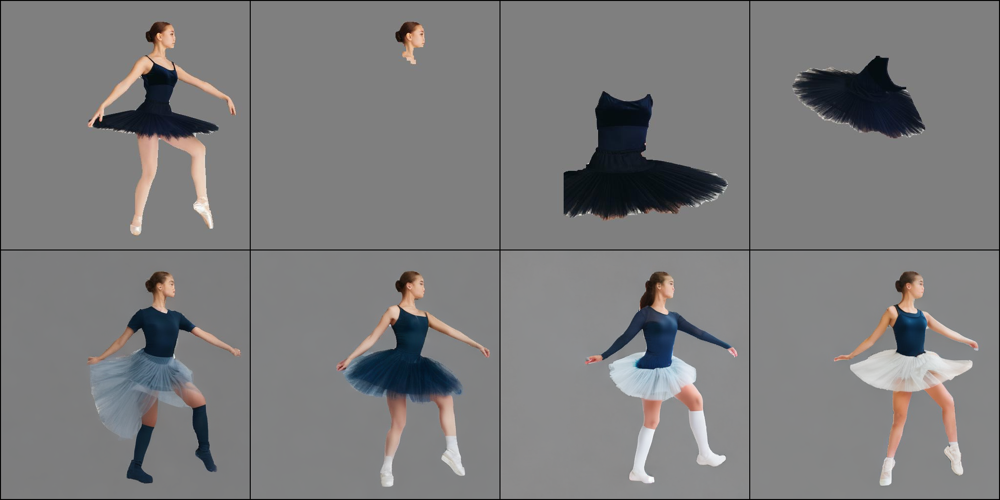
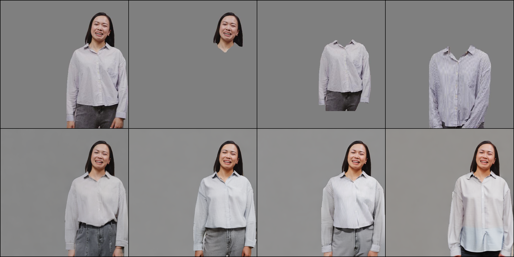
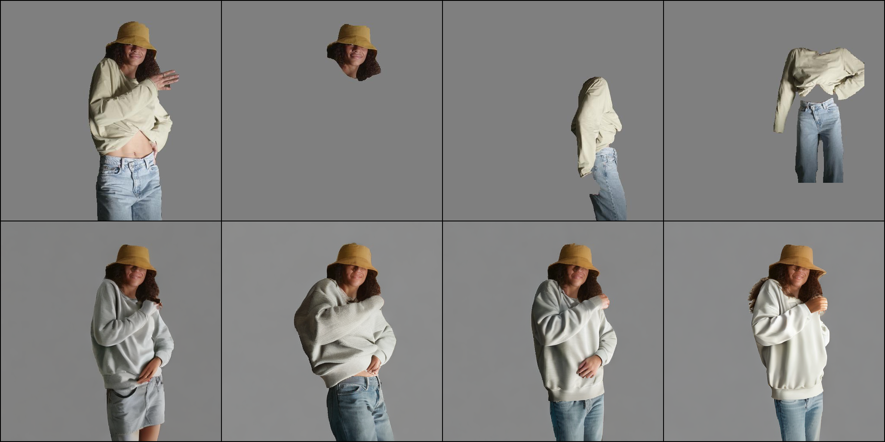
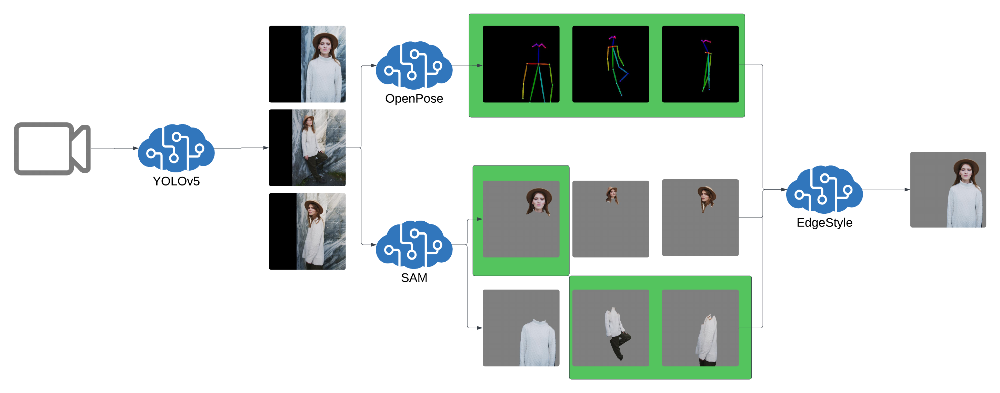
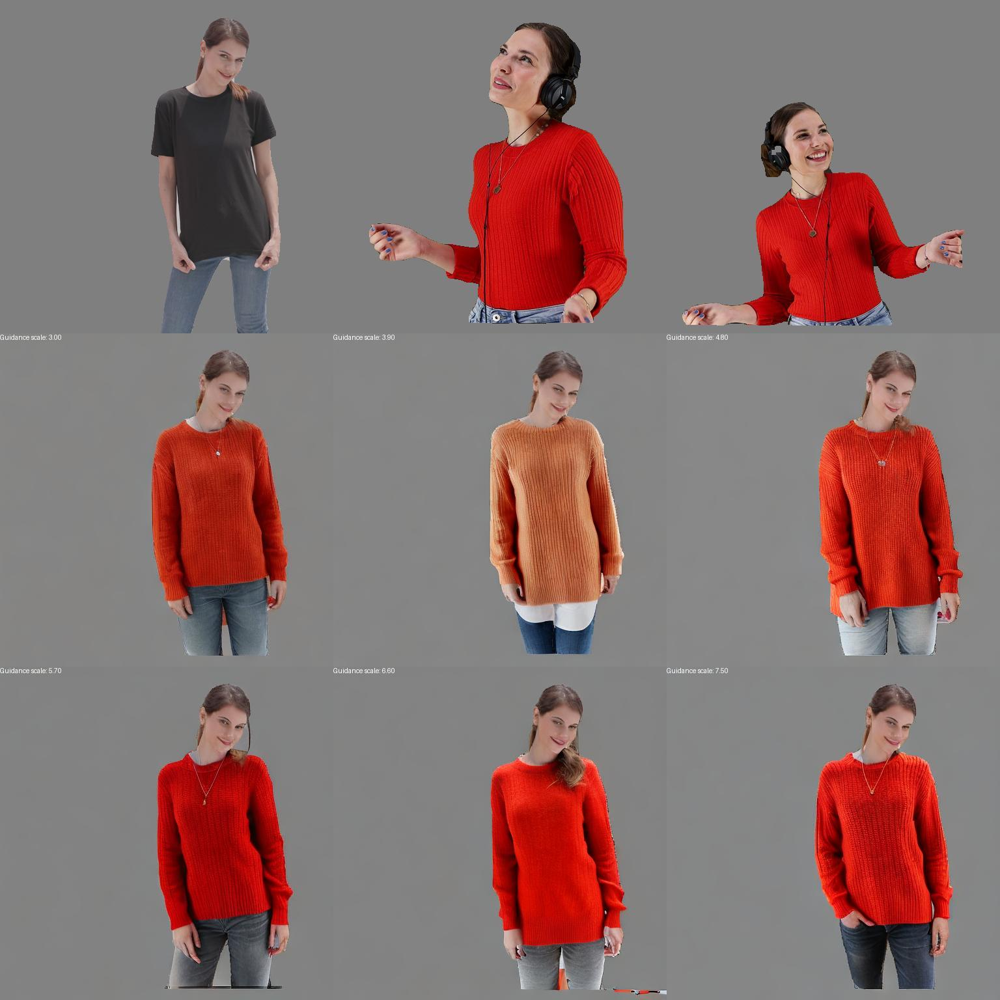
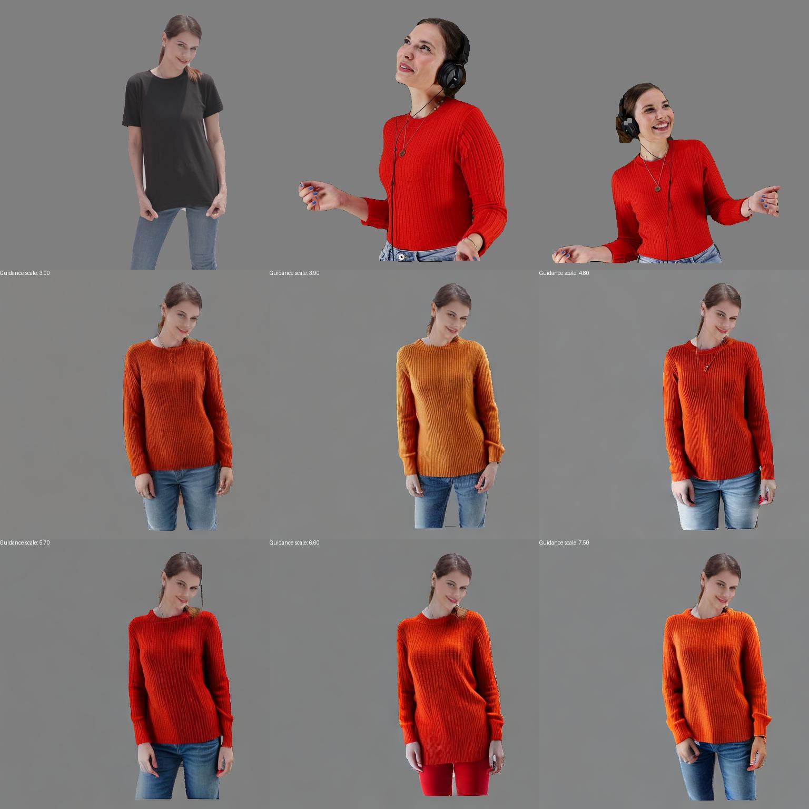

# Dependecies
## Install PyTorch

https://pytorch.org/get-started/locally/
```
pip install torch torchvision torchaudio 
```

## Proceed with setting up the remaining dependencies
```
pip install -r requirements.txt
```
Or alternatively
```
pip install lightning tensorboard torch-tb-profiler opencv-python pandas  controlnet-aux tqdm  torchpack onnx onnxsim segment_anything monai  prodigyopt torchmetrics[multimodal] gradio fvcore torchinfo

pip install datasets transformers accelerate diffusers
```

# Segmentation
## Copy EfficientViT-L2-SAM checkpoint
from https://huggingface.co/han-cai/efficientvit-sam/blob/main/l2.pt or https://huggingface.co/andrei-ace/EdgeStyle/tree/main/sam to efficientvit/assets/checkpoints/sam/l2.pt

## Download pretrained segmentation models from 
https://huggingface.co/andrei-ace/EdgeStyle/tree/main/sam
```
efficientvit/assets/checkpoints/sam/trained_model_subject.pt
efficientvit/assets/checkpoints/sam/trained_model_body.pt
efficientvit/assets/checkpoints/sam/trained_model_clothes.pt
efficientvit/assets/checkpoints/sam/trained_model_head.pt
```
## Alternatively finetune 
### Finetune SAM model for subject extraction
```
python segmenter_training_subject.py
```
Optionally run tensorboard (ex)
```
tensorboard --logdir sam_subject/lightning_logs/
```

### Finetune SAM model for subject's head and neck extraction
```
python segmenter_training_head.py
```

### Finetune SAM model for subject's clothes extraction
```
python segmenter_training_clothes.py
```

### Finetune SAM model for subject's body extraction
```
python segmenter_training_body.py
```

# Dataset
## Create the dataset from videos (optional)
```
python extract_dataset.py
```

# Training
## Start training for 20k steps
```
accelerate launch train_text2image_pretrained_openpose.py \
--pretrained_model_name_or_path="SG161222/Realistic_Vision_V5.1_noVAE" \
--pretrained_vae_name_or_path="stabilityai/sd-vae-ft-mse" \
--pretrained_openpose_name_or_path="lllyasviel/control_v11p_sd15_openpose" \
--output_dir="models/output_text2image_pretrained_openpose" \
--resolution=512 \
--train_batch_size=2 \
--gradient_accumulation_steps 32 \
--mixed_precision fp16 \
--controllora_use_vae \
--seed=42 \
--resume_from_checkpoint latest \
--num_validation_images 4 \
--checkpoints_total_limit 3 \
--dataloader_num_workers 2 \
--snr_gamma=5.0 \
--optimizer="prodigy" \
--learning_rate=1.0 \
--prodigy_safeguard_warmup=True \
--prodigy_use_bias_correction=True \
--adam_beta1=0.9 \
--adam_beta2=0.99 \
--adam_weight_decay=0.01 \
--proportion_empty_prompts=0.1 \
--proportion_empty_images=0.1 \
--proportion_cutout_images=0.1 \
--proportion_patchworked_images=0.1 \
--proportion_patchworks=0.1 \
--validation_steps 100 \
--checkpointing_steps 100 \
--max_train_steps=20000
```

## Check the training status using tensorboard

### training loss


### training learning rate


### Logged Example Images After 15.7k Training Steps:

The first image on the left is the ground truth, which serves as a benchmark for comparison. It is followed by a series of images related to the control networks, including:

* An agnostic image,
* The initial outfit image,
* The subsequent outfit image.

Notably, images pertaining to the openpose are excluded from this lineup.

Additionally, the second row showcases the outputs generated by the model after fine-tuning, corresponding to different guidance scales set at 3.0, 4.5, 6.0, and 7.5, respectively. This arrangement illustrates the model's performance variation when influenced by different levels of guidance.






## EdgeStyle Training Overview
The EdgeStyle architecture integrates six control images to guide the diffusion process. These images are highlighted in green in the architecture diagram below for clear identification.


# Running inference

```
python test_text2image_pretrained_openpose.py \
--pretrained_model_name_or_path="SG161222/Realistic_Vision_V5.1_noVAE" \
--pretrained_vae_name_or_path="stabilityai/sd-vae-ft-mse" \
--pretrained_openpose_name_or_path="lllyasviel/control_v11p_sd15_openpose" \
--controlnet_model_name_or_path="models/output_text2image_pretrained_openpose" \
--controllora_use_vae \
--prompt_text_to_add=", gray background, RAW photo, subject, 8k uhd, dslr, soft lighting, high quality" \
--negative_prompt="deformed iris, deformed pupils, semi-realistic, cgi, 3d, render, sketch, cartoon, drawing, anime, mutated hands and fingers, deformed, distorted, disfigured, poorly drawn, bad anatomy, wrong anatomy, extra limb, missing limb, floating limbs, disconnected limbs, mutation, mutated, ugly, disgusting, amputation" \
--source_path="data/image/pexels-angela-roma-7316379 (2160p)" \
--source_image_name="10.jpg" \
--target_path="data/image/girl_-_44686 (1080p)" \
--target_image_name="0.jpg" \
--target_path2="data/image/girl_-_44686 (1080p)" \
--target_image_name2="3.jpg" \
--result_path="temp/test_data" \
--image_result_name="pretrained_openpose.jpg"
```

## Results after 20k training steps


## Results after 21.5k training steps



# Running on jetson 

## Create local environment (Optional)

```
cat /etc/nv_tegra_release 
# R35 (release), REVISION: 2.1
```

Install pytorch and pyvision 

```
sudo apt-get install libssl-dev
wget https://github.com/Kitware/CMake/releases/download/v3.28.3/cmake-3.28.3.tar.gz
tar zxf cmake-3.28.3.tar.gz
cd cmake-3.28.3/
./bootstrap
make -j$(nproc)
sudo make install
```

Install onnxruntime_gpu 
```
wget https://nvidia.box.com/shared/static/mvdcltm9ewdy2d5nurkiqorofz1s53ww.whl -O onnxruntime_gpu-1.15.1-cp38-cp38-linux_aarch64.whl
pip3 install onnxruntime_gpu-1.15.1-cp38-cp38-linux_aarch64.whl
python3 -m pip install onnx_graphsurgeon --index-url https://pypi.ngc.nvidia.com
```

```
pip3 install --upgrade setuptools
pip3 install -r requirements-jetson.txt
```

Make sure you have git lfs installed !(git lfs)[https://git-lfs.com/]
```
mkdir -p models
cd models
git clone https://huggingface.co/andrei-ace/EdgeStyle
git clone https://huggingface.co/SG161222/Realistic_Vision_V5.1_noVAE
git clone https://huggingface.co/stabilityai/sd-vae-ft-mse
git clone https://huggingface.co/lllyasviel/control_v11p_sd15_openpose
git clone https://huggingface.co/openai/clip-vit-large-patch14
```

```
python3 app.py
```

## Docker image (Recommended)
```
docker run --runtime nvidia -it --rm --network=host --rm andreiciobanu1984/edgestyle:1.0
```

### Build docker image (Optional)
```
docker build -t andreiciobanu1984/edgestyle:1.0 .
```

## ONNX

```
optimum-cli export onnx -m ./clip-vit-large-patch14/ --task image-to-text clip-vit-large-patch14-onnx
optimum-cli export onnx -m ./Realistic_Vision_V5.1_noVAE/ --task stable-diffusion Realistic_Vision_V5.1_noVAE-onnx
```


```
python export_onnx.py
```
Large error
```
AssertionError: 
Not equal to tolerance rtol=0.001, atol=1e-05

Mismatched elements: 5841 / 32768 (17.8%)
Max absolute difference: 0.00092185
Max relative difference: 103.04526
 x: array([[[[ 1.31208 , -1.244555,  1.00645 , ...,  0.53056 , -0.263657,
           0.577149],
         [-0.548291,  0.613406,  0.165211, ...,  0.237761, -0.388499,...
 y: array([[[[ 1.311924, -1.244697,  1.006474, ...,  0.530382, -0.263636,
           0.577266],
         [-0.548179,  0.613441,  0.165163, ...,  0.237911, -0.388577,...
```


```
python symbolic_shape_infer.py --input ./models/EdgeStyle/unet/model.onnx --output models/EdgeStyle/unet/model-shape-infer.onnx --auto_merge

python3 -m onnxruntime.tools.symbolic_shape_infer --input ./models/EdgeStyle/unet/model.onnx --output ./models/EdgeStyle/unet/model.onnx-infer --verbose 3 --save_as_external_data --external_data_size_threshold 1024
```